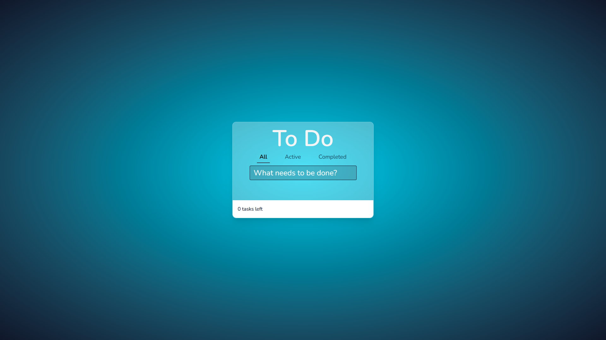
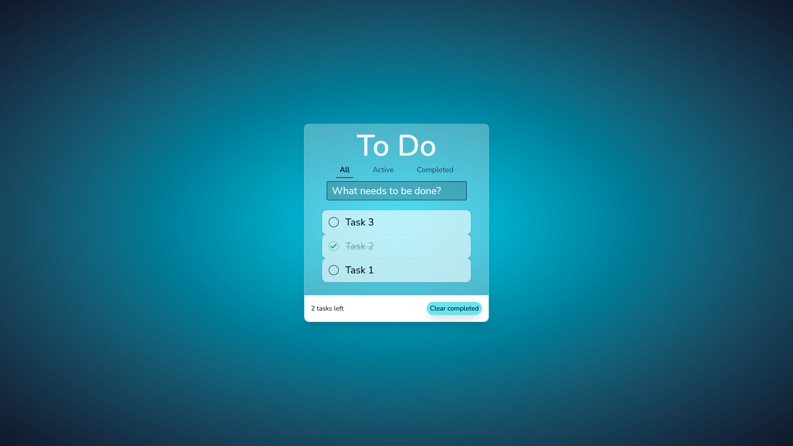
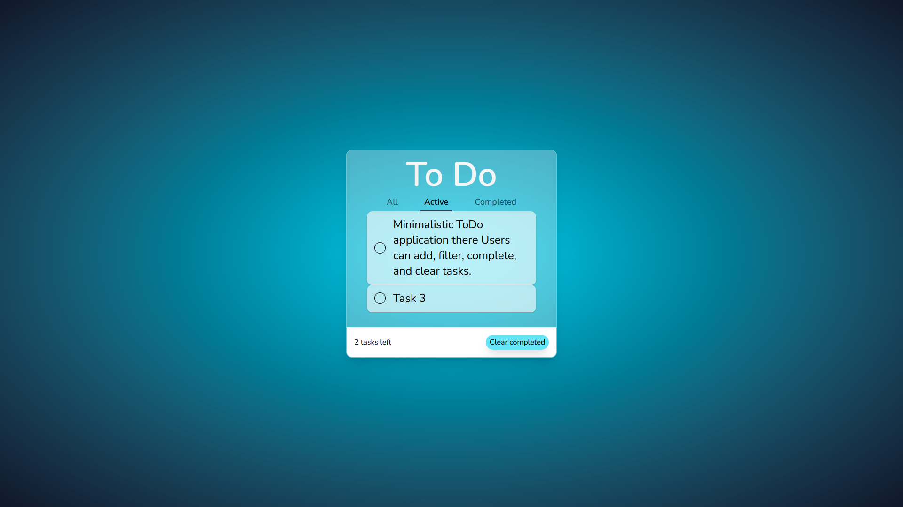
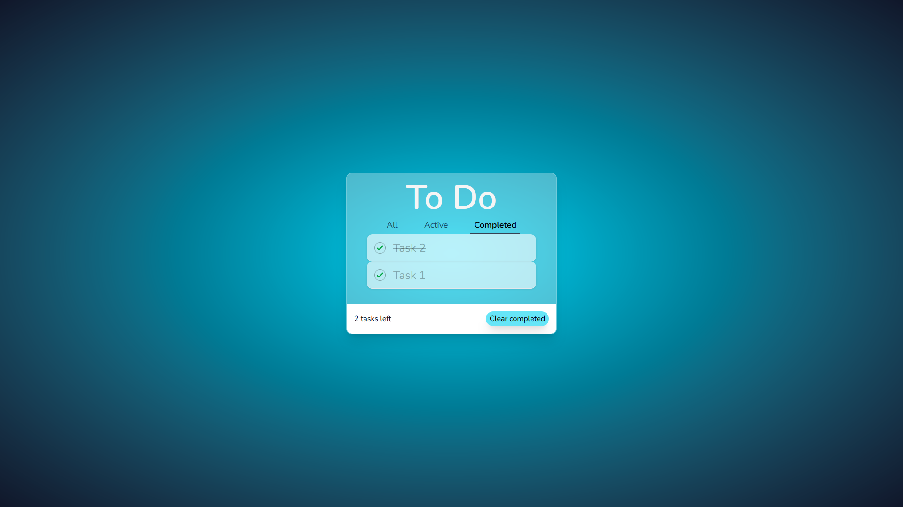

# 📝 ToDo App

A minimalistic ToDo application written in TS + React. User can add new tasks of any size. There are 3 tabs: All, Active and Completed.
All displays the field for adding tasks and all tasks. Active displays only active tasks, Completed displays only tasks marked as completed.
There is a counter of active tasks, and when at least one task is marked as completed, the “Clear Completed” button appears, which deletes all completed tasks.
Long task text is competently transferred, and when adding a large number of tasks a scroll appears.

## 🚀 Tech Stack

- **React**
- **TypeScript**
- **React Router DOM**
- **Tailwind CSS**
- **Framer Motion**
- **Vitest**
- **@testing-library/react**
- **Vite**
- **uuid**

## 📸 Screenshot









## 📁 Project Structure

<pre>
ToDo-app/
├── screenshots/ 
└── src/
  ├── __tests__/           
  │ ├── App.test.tsx       
  │ └── TaskList.test.tsx        
  ├── Active.tsx
  ├── All.tsx
  ├── App.tsx  
  ├── Completed.tsx
  ├── index.css    
  ├── main.tsx       
  ├── TaskList.tsx               
  └── TodoInput.tsx            
</pre>

## 🧪 Testing

This app uses:

- **Vitest**
- **@testing-library/react**
- **MemoryRouter**

Example tests are located in `src/__tests__/`.

## 🛠 Installation & Setup

### 1. Clone the repository:

```bash
git clone https://github.com/your-username/todo-app.git
cd todo-app
```

### 2. Install and Start:

```bash
npm i && npm run start
```

### Run tests:

```bash
npm run test
```
